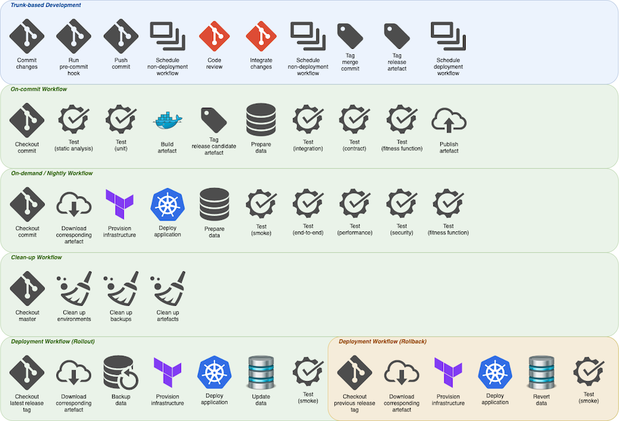

# Make DevOps

If you hear your teams or individuals saying _"It will take days to onboard a new member..."_, _"It works on my machine..."_ or _"Our pipeline is to complex and no one really understands how it all works..."_ then you need to invest more in automation and perhaps take an interest in this project. This project will help you to make your deploys boring!

## Use cases

- CI/CD building blocks to support a clean implementation of your pipelines
- Development workflow with highly customisable project toolchain (inspired by dotfiles) for advanced \*NIX shell scripting
- macOS setup to complement the above and fully automate development environment provisioning

## Installation

- To set up your development environment on a macOS run `curl -L bit.ly/make-devops | bash`
- For a project toolchain integration, copy the content of the `build` directory and the top-level `Makefile` file to your project, commit your changes then run `make devops-synchronise`
- Use make targets to support your CI/CD flow

## Features

- Shell native
- Automated setup
- Local development flow support
- Pipeline consistency and testability
- Highly customisable and flexible implementation
- Integration with a 3rd-party packages and services
  - [Docker](build/automation/lib/docker.mk)
  - [Kubernetes](build/automation/lib/k8s.mk)
  - [Terraform](build/automation/lib/terraform.mk)
  - [AWS](build/automation/lib/aws.mk)
  - SonarQube (coming soon)
  - Twistlock (coming soon)
  - Notifications, e.g. email and Slack (coming soon)
  - Technology radar (coming soon)
  - [macOS](build/automation/lib/macos.mk)
- Unit and integration [tests](build/automation/test)
- Example of a monolithic repository structure that consists of multiple projects
- Architectural decision record [template](documentation/adr/README.md)
- Deployment [profiles](build/automation/var/profile/README.md)
- Data Docker image to [run SQL scripts](build/docker/data/assets/sbin/entrypoint.sh) against a database instance
- Tools Docker image with [various command-line utilities](build/docker/tools/Dockerfile) pre-installed
- Pre-commit [git hook](build/automation/etc/githooks/pre-commit) example
- Visual Studio Code and iTerm configuration
- Virtual environments for Python, Go, Java and Node.js
- AWS MFA [script](build/automation/bin/texas-mfa)
- Toggle natural scrolling [script](build/automation/bin/toggle-natural-scrolling)
- Remote pair programming and [live collaboration](https://marketplace.visualstudio.com/items?itemName=MS-vsliveshare.vsliveshare)

## Usage

- Run `make help-all` to see all available targets
- Update the toolchain scripts to the most recent version by executing `make devops-synchronise`
- Use `make devops-print-variables` to print out all the effective variables. Include `PROFILE=[name]` to evaluate profile specific variables
- To run unit test suite use `make devops-test-suite` or alternatively to run a single one execute `make devops-test-single NAME=[test target name]`. Set the `DEBUG=true` flag to run the tests in the verbose mode
- To provision your macOS run `make macos-setup` or alternatively update configuration `make macos-config`

## Conventions

- Set all the profile specific information in a `build/automation/var/profile/[name].mk` file
- Set all the project specific information in the `build/automation/var/project.mk` file. There is set of mandatory variables that must be defined for the library to function correctly. For more details, please refer to the `build/automation/var/project.mk.default` file
- Your development flow should be described in the main `Makefile` in the root directory of the project. Content of that file must meet certain implementation requirements and include some predefined sections
- Create custom helper targets in the `Makefile` file or in the individual sub-project directories. These targets should be lower-level targets supporting your project's development flow
- If a library target does not work in the expected way there are two ways of solving that issue
  - Create a patch, raise an MR and assign it to one of the library maintainers
  - Override the make target by creating it with the same name in the `build/automation/var/project.mk` file
- Target name convention
  - Use `descriptive-name`
  - Create `project-*` targets for the ops work flow or production usage, e.g. `project-build`, `project-deploy`
  - Create `dev-*` targets for the dev work flow, e.g. `dev-build`
  - Create `[component]-[activity]` complementary targets
  - Prefix target with the underscore i.e. `_descriptive-name` to indicate that it is a 'private' target
  - Do not exceed 40 characters
- Target help convention
  - Sample format is `# Target description - mandatory: ARG1=[argument description]; optional: ARG2="argument-value"; returns: [string]`
  - Prefix with `#` to indicate project development flow target listed by `make help` or `help-project-flow`
  - Prefix with `##` to indicate development supporting target listed by `make help-project-supporting`
  - Prefix with `###` to indicate library target, use `make help-all` to see the full list of available targets
  - An argument is mandatory when target cannot function without it being specified and this argument is not a configuration option
  - An argument is optional when it is provided by a profile, however it is intended to be set from the command-line depending on the context
- Best practices
  - Use the same names for secret keys and make variables defined in your profiles
  - Group variables logically, e.g. `DB_HOST`, `DB_PORT`, `DB_NAME`, `DB_USERNAME`, `DB_PASSWORD` create a one group
  - Sort a group of variables alphabetically if there is no direct correlation between them, e.g. `TF_VAR_route53_terraform_state_key`, `TF_VAR_vpc_terraform_state_key`
  - Never modify library files, except the `Makefile` and files that are in the `build/automation/var` directory which are project-specific
  - Always use a single tab character for code indentations
  - Follow the variables assignment [rules](https://www.gnu.org/software/make/manual/html_node/Flavors.html#Flavors) to avoid an unexpected result
  - Naming
    - ECR image: `$(PROJECT_GROUP)/$(PROJECT_NAME)/$(NAME)`
    - K8s namespace: `$(PROJECT_GROUP_SHORT)-$(PROJECT_NAME_SHORT)-$(PROFILE)` or `$(PROJECT_GROUP_SHORT)-$(PROJECT_NAME_SHORT)-$(PROFILE)-job`
    - Terraform state: `$(PROJECT_GROUP)-$(PROJECT_NAME)/$(PROFILE)/$(STACK)`
    - AWS tags: `TagSet=[{Key=Programme,Value=$(PROGRAMME)},{Key=Service,Value=$(TEXAS_SERVICE_TAG),{Key=Environment,Value=$(PROFILE)}]`
    - AWS secret name for deployment: `$(PROJECT_GROUP_SHORT)-$(PROJECT_NAME_SHORT)-$(PROFILE)`
    - AWS resources prefix: `$(PROJECT_GROUP_SHORT)-$(PROJECT_NAME_SHORT)-*`
    - Local domain names: `$(PROJECT_NAME_SHORT).local`, `$(PROJECT_NAME).local`, `$(PROJECT_NAME_SHORT)-$(PROJECT_GROUP_SHORT).local`
  - Versioning
    - Library Docker images: `YYYYmmdd` - fixed on the date of modification
    - Application Docker images: `YYYYmmddHHMMss` - dynamic, set during the build process
    - Release: `YYYYmmddHHMMss-release` - dynamic, set by the deployment process

## Guiding Principles

- Simplicity and usability
- Do one thing well
- Clear intent, principle of least surprise
- Non-enforcing and supporting role
- Well documented, documentation as code
- A pipeline can run anywhere, e.g. any \*NIX like system
- Technology agnostic and universal design that can support Java, .NET, Python, Go, Node and others

## CI/CD Design

## Status

| Category                | Badges                                                                                                                                                                                                                                          |
| ----------------------- | ----------------------------------------------------------------------------------------------------------------------------------------------------------------------------------------------------------------------------------------------- |
| Automated Test          |                                                                                                                     |
| Docker `nginx` image    | &nbsp;             |
| Docker `postgres` image | &nbsp; |
| Docker `tools` image    | &nbsp;             |
