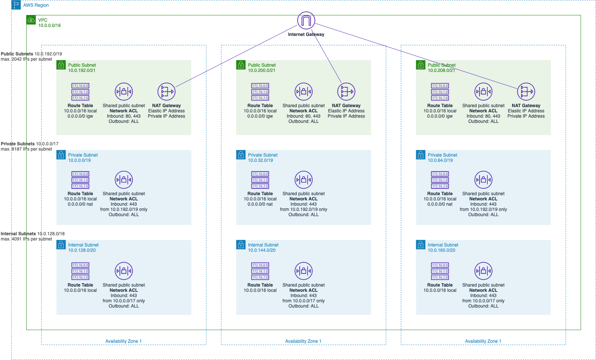

# networking

## Description

This stack provisions a Multi-AZ and multi-subnet VPC infrastructure with managed NAT gateways in the public subnet for each Availability Zone.

## Design

## Usage

### Create an operational stack from the template

    make project-create-profile NAME=tools
    make project-create-infrastructure MODULE_TEMPLATE=vpc STACK_TEMPLATE=networking PROFILE=tools

### Provision the stack

Depending on the order of execution some of the data sections (except the `terraform-state`) in the `infrastructure/stacks/networking/data-texas-v2.tf` file may need to be commented out temporary and restored right after.

    make terraform-plan STACK=networking PROFILE=tools
    make terraform-apply-auto-approve STACK=networking PROFILE=tools

## Links

- [VPC Architecture](https://docs.aws.amazon.com/quickstart/latest/vpc/architecture.html)
- [VPCs and subnets](https://docs.aws.amazon.com/vpc/latest/userguide/VPC_Subnets.html)
