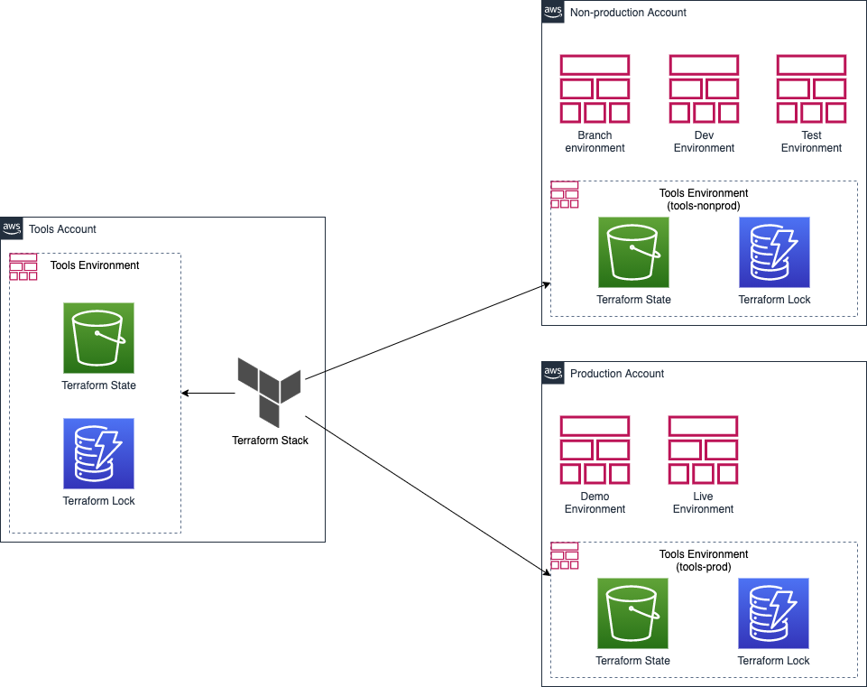

# terraform-state

## Description

This stack provisions S3 bucket and DynamoDB table to store the Terraform state of the corresponding infrastructure.

## Design

## Usage

### Create an operational stack from the template

    make project-create-infrastructure MODULE_TEMPLATE=s3,dynamodb STACK_TEMPLATE=terraform-state
    make project-create-profile NAME=tools
    cat << HEREDOC >> build/automation/var/profile/tools.mk
    TERRAFORM_STATE_BUCKET_NAME = \$(TERRAFORM_STATE_STORE)
    TERRAFORM_STATE_TABLE_NAME = \$(TERRAFORM_STATE_LOCK)
    HEREDOC

### Provision the stack

Firstly, the content of the `terraform.tf` file has to be commented out as the S3 bucket to store the state has not yet been created.

    make terraform-apply-auto-approve STACK=terraform-state TERRAFORM_USE_STATE_STORE=false PROFILE=tools

### Store its own state

Now, having created the S3 bucket to store the state and DynamoDB table to acquire the lock, it is time to upload the local state. Therefore, restore the content of the `terraform.tf` file back to what it was originally prior to executing the following command.

    make terraform-apply-auto-approve STACK=terraform-state TERRAFORM_DO_NOT_REMOVE_STATE_FILE=true PROFILE=tools

## Links

- [How to manage Terraform state](https://blog.gruntwork.io/how-to-manage-terraform-state-28f5697e68fa)
